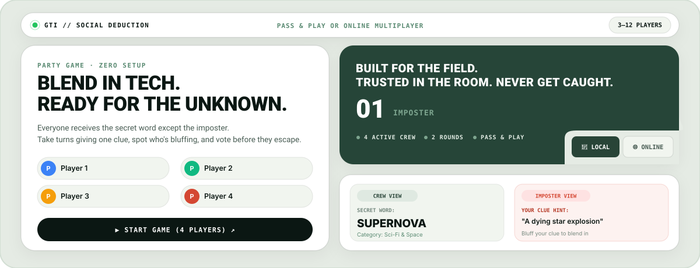
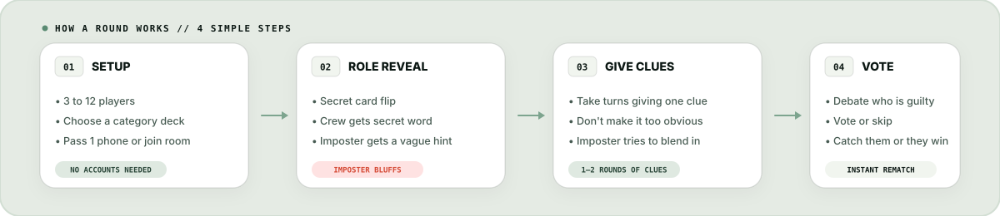

<p align="center">
  
</p>

<p align="center">
  <strong>A tactical social deduction party game powered by serverless AI and real-time multiplayer.</strong><br>
  Pass &amp; play on one phone or connect with friends across devices in real time.
</p>

<p align="center">
  <a href="#quickstart">Quickstart</a> •
  <a href="#gameplay-loop">How to Play</a> •
  <a href="#core-capabilities">Features</a> •
  <a href="#architecture">Architecture</a> •
  <a href="#tech-stack">Tech Stack</a>
</p>

---

## What is Guess The Imposter?

**Guess The Imposter (GTI)** is a modern social deduction party game inspired by *Spyfall* and *The Chameleon*. 

In every mission:
1. **The Crew** receives the secret coordinate (e.g. `SUPERNOVA`).
2. **The Infiltrator (Imposter)** receives only an intentionally cryptic, atmospheric hint synthesized by **Google Gemini 2.5 Flash** (e.g. *"A high-energy celestial explosion ending a star's lifecycle"*).
3. Players take turns giving subtle, one-sentence clues to prove their innocence without giving the secret away to the imposter.
4. An **Emergency Vote** is called to unmask the imposter before they deduce the secret word and escape.

Designed with an **industrial tactical bento UI**, crisp sound design, and responsive layouts that look native on mobile phones, tablets, and desktop displays.

---

## Workflow & Gameplay Loop

<p align="center">
  
</p>

---

## Core Capabilities

### 📱 Dual Play Modes
- **Local Pass & Play (1 Device):** Play anywhere with friends on a single phone or tablet. Uses a 3D secret card flip and role-reveal countdown so only the active player sees their identity. Works 100% offline.
- **Online Multiplayer (Multi-Device):** Host a lobby and invite friends via a 6-character room code (e.g. `GTI-8492`), shareable link, or QR code. Synchronized turns, live clue feed, and real-time emergency voting powered by **Supabase Realtime**.

### 🧠 Serverless AI Word & Hint Synthesis
- Integrated with **Google Gemini 2.5 Flash** via a dedicated **Supabase Edge Function** (`supabase/functions/generate-word`).
- **Anti-Cheat Integrity:** The `GEMINI_API_KEY` lives strictly in serverless Supabase Secrets—never exposed to client browser network tabs.
- **Vagueness Engine:** The AI model is strictly instructed to generate abstract sensory hints for the imposter that apply to multiple items in the category, preventing instant deducibility while enabling convincing bluffs.
- **Resilient Fallback:** Automatically switches to curated preset word decks if the backend is unreachable or offline.

### 🗂️ 10+ Curated Decks & Custom Categories
Choose from diverse word decks or filter your active rotation:
- 🍕 Food & Culinary
- 🎬 Movies & Cinema
- 🌍 Places & World Landmarks
- 🐾 Animals & Wildlife
- 🎮 Gaming & Esports
- ⚽ Sports & Athletics
- ☕ Everyday Objects
- 💼 Professions
- 🦸 Superheroes & Comics
- 🚀 Sci-Fi & Space

### 🎨 Industrial Bento UI
- Built with a tactical palette: deep sage (`#162c23`), field cream (`#e5ebe4`), and alert crimson (`#d44732`).
- Signature concave corner-notch card architecture with tactile sound effects.
- Fully responsive layout engineered for narrow mobile screens (320px+) up to wide 4K displays.

---

## How to Play

| Phase | What Happens | Strategy Tip |
| :--- | :--- | :--- |
| **1. Role Reveal** | Each player checks their role privately. Crew learns the exact word; Imposter gets only a cryptic hint. | **Imposter:** Do not react! Memorize your hint and note the category. |
| **2. Clue Cycles** | Players take turns giving a one-sentence clue related to the secret word. | **Crew:** Be specific enough to signal you know the word, but vague enough not to give it away. |
| **3. Discussion** | Players debate suspicious clues, hesitation, or inconsistencies. | **Imposter:** Mirror other players' tone, confidence, and vocabulary. |
| **4. Emergency Vote** | Everyone casts a secret ballot for the suspected imposter, or skips. | If the imposter receives the most votes, **Crew Wins**. If an innocent is ejected or votes tie, **Imposter Escapes**! |

---

## Architecture

```text
┌────────────────────────────────────────────────────────┐
│                   React 19 Frontend                    │
│   (Vite 8 · TypeScript · Responsive Bento Interface)   │
└───────────────┬────────────────────────┬───────────────┘
                │                        │
       Supabase Realtime          Edge Functions
       (WebSockets / Postgres)    (Deno Serverless)
                │                        │
  ┌─────────────▼────────────┐  ┌────────▼──────────────┐
  │  Realtime Room Sync      │  │  generate-word        │
  │  • Rooms & Players       │  │  • Supabase Secrets   │
  │  • Realtime Clues        │  │  • Gemini 2.5 Flash   │
  │  • Ballots & Tally       │  │  • Anti-cheat Engine  │
  └──────────────────────────┘  └───────────────────────┘
```

---

## Quickstart

### Prerequisites
- [Node.js](https://nodejs.org/) (v20 or higher recommended)
- [npm](https://www.npmjs.com/) (v10 or higher)

### 1. Clone & Install
```bash
git clone https://github.com/ArcadeLabs74/Guess-The-Imposter.git
cd Guess-The-Imposter
npm install
```

### 2. Configure Environment Variables
Create a `.env` file in the project root:
```env
VITE_SUPABASE_URL=your_supabase_project_url
VITE_SUPABASE_ANON_KEY=your_supabase_anon_key
```

> **Note:** The app functions out of the box in **Local Pass & Play mode** with curated preset decks even without Supabase credentials. Supabase is required for online multiplayer and AI word synthesis.

### 3. Run Development Server
```bash
npm run dev
```
Open [http://localhost:5173](http://localhost:5173) in your browser.

### 4. Build for Production
```bash
npm run build
```

---

## Supabase Edge Function Setup (Optional)

To enable live Gemini AI generation in your own Supabase project:

1. **Install the Supabase CLI:**
   ```bash
   npm install -g supabase
   ```

2. **Set your Gemini API Key in Supabase Secrets:**
   ```bash
   supabase secrets set GEMINI_API_KEY="your-gemini-api-key"
   ```

3. **Deploy the Edge Function:**
   ```bash
   supabase functions deploy generate-word
   ```

---

## Project Structure

```text
Guess-The-Imposter/
├── assets/
│   └── readme/
│       ├── hero.svg            # Native tactical bento hero visual
│       └── flow.svg            # 4-stage system workflow diagram
├── src/
│   ├── components/             # Bento UI screens (Home, Reveal, Clue, Vote, Results)
│   ├── data/                   # Curated category decks and word banks
│   ├── lib/                    # Animations (AnimeJS) and sound effects
│   ├── services/               # Supabase multiplayer, auth, and Gemini service
│   ├── types/                  # TypeScript interfaces for games, rooms, and players
│   ├── App.tsx                 # Root state machine and router
│   ├── main.tsx                # React 19 entry point
│   └── index.css               # Design tokens, bento layout, and notch system
├── supabase/
│   └── functions/
│       └── generate-word/      # Deno serverless edge function for Gemini AI
├── package.json
└── vite.config.ts
```

---

## Tech Stack

| Category | Technology | Purpose |
| :--- | :--- | :--- |
| **Framework** | [React 19](https://react.dev/) | Component architecture and state management |
| **Build Tool** | [Vite 8](https://vite.dev/) | Lightning-fast HMR and optimized bundling |
| **Language** | [TypeScript 6](https://www.typescriptlang.org/) | End-to-end type safety across client and edge functions |
| **Backend & Realtime** | [Supabase](https://supabase.com/) | Real-time WebSockets, room states, and player presence |
| **AI Synthesis** | [Google Gemini 2.5 Flash](https://ai.google.dev/) | Dynamic secret word & cryptic imposter hint generation |
| **Edge Compute** | [Deno / Supabase Functions](https://supabase.com/docs/guides/functions) | Serverless anti-cheat word generation endpoint |
| **Icons & Audio** | [Lucide React](https://lucide.dev/) | Tactical iconography and procedural audio cues |
| **Animations** | [AnimeJS](https://animejs.com/) + [Canvas Confetti](https://www.npmjs.com/package/canvas-confetti) | Polished card transitions and victory effects |

---

## Contributing

Contributions, bug reports, and new word deck suggestions are welcome!
1. Fork the repository
2. Create your feature branch (`git checkout -b feature/tactical-deck`)
3. Commit your changes (`git commit -m "Add Cyberpunk word deck"`)
4. Push to the branch (`git push origin feature/tactical-deck`)
5. Open a Pull Request

---

## License

This project is open source and available under the [MIT License](LICENSE).
